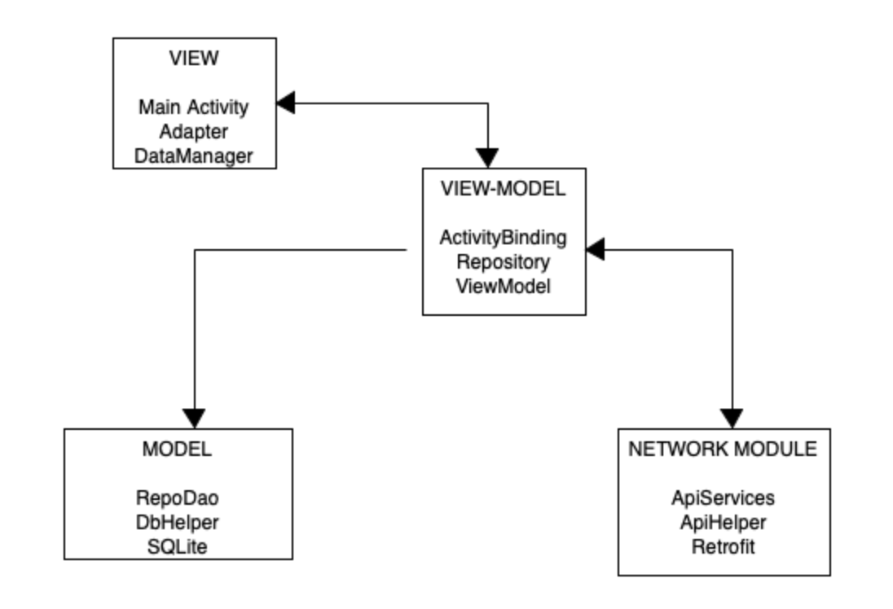

# DoorDashLite
The Bird Eye view for the application architecture is attached below in the picture.

The follows the principal of MVVM architecture. 
-The View (UI part), 
-The Model 
    	Contains client based SQLite database for quick access and smooth functioning of data displayed to the user via UI component. This is useful when there is no new data update from backend, or the data is being downloaded from cloud is having som latency or the device is in offline condition.
    	Also contains the network module where API services are used to fetch the data from cloud. Once the data is available, it informs the view-model framework. The view-model framework then inform UI component about new data and asks UI component to update itself. At the same time it also informs the local database framework to update with new data.
    
-The View-Model, 
This framework helps in keeping UI component independent of Model component. This help in avoiding the blocking operation such as network operation to be coupled with UI, also it's a great help in writing the unit tests as all these architecture component can be tested separately without any dependence on each other.

